# JVM 虚拟机深入理解

> "深入理解 JVM，是成为 Java 高级工程师的必经之路。"

---

## 目录

1. [JVM 概述](#1-jvm-概述)
2. [JVM 内存模型](#2-jvm-内存模型)
3. [垃圾回收机制](#3-垃圾回收机制)
4. [类加载机制](#4-类加载机制)
5. [JVM 性能调优](#5-jvm-性能调优)
6. [实战问题排查](#6-实战问题排查)

---

## 1. JVM 概述

### 1.1 什么是 JVM

**JVM（Java Virtual Machine）** 是 Java 程序的运行环境，它是一个虚拟的计算机，具有自己的指令集和内存管理机制。

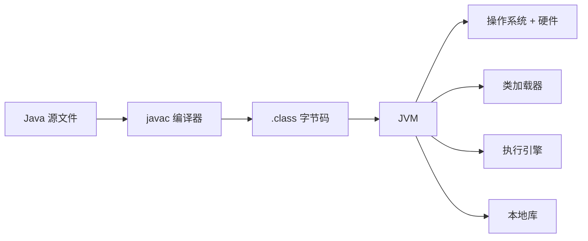

### 1.2 JVM 的核心功能

```
JVM 核心功能：
• 字节码执行
• 内存管理（自动分配/回收）
• 平台无关性（一次编译，到处运行）
• 安全性（沙箱机制）
```

### 1.3 JVM 体系结构

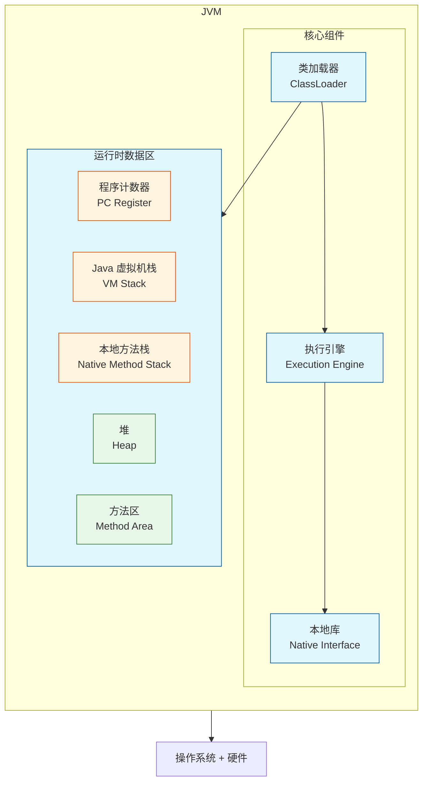

---

## 2. JVM 内存模型

### 2.1 运行时数据区

JVM 在运行时会分配不同的内存区域，用于存储不同的数据：

| 区域 | 线程共享 | 用途 |
|------|----------|------|
| **程序计数器** | 否 | 记录当前线程执行的字节码行号 |
| **Java 虚拟机栈** | 否 | 存储局部变量表、操作数栈、动态链接 |
| **本地方法栈** | 否 | 为 Native 方法服务 |
| **堆** | 是 | 对象实例、数组 |
| **方法区** | 是 | 类信息、常量、静态变量、JIT 编译产物 |

### 2.2 堆内存模型

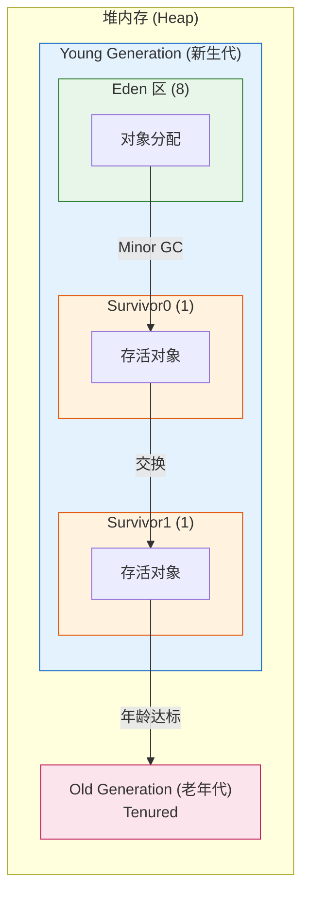

> **默认比例**：Young : Old = 1 : 2
> **Eden : S0 : S1 = 8 : 1 : 1

### 2.3 虚拟机栈详解

每个线程都有自己的虚拟机栈，栈由**栈帧**组成：

```mermaid
flowchart TB
    subgraph Stack["Java 虚拟机栈"]
        direction TB

        Frame3["栈帧 3 (当前活跃)<br/>Active Frame"]
        Frame2["栈帧 2"]
        Frame1["栈帧 1"]
    end

    subgraph Frame3Details["栈帧结构"]
        direction LR
        LV[局部变量表<br/>Local Variables]
        OS[操作数栈<br/>Operand Stack]
        DL[动态链接<br/>Dynamic Linking]
        RA[方法返回地址<br/>Return Address]
    end

    Frame3 --- Frame3Details

    style Frame3 fill:#e1f5fe,stroke:#01579b
    style Frame2 fill:#f5f5f5,stroke:#616161
    style Frame1 fill:#f5f5f5,stroke:#616161

### 2.4 常见内存溢出

```
1. Java 堆溢出
   - 原因：对象创建过多，GC 后仍不足
   - 解决：增加堆大小、检查内存泄漏

2. 虚拟机栈溢出
   - 原因：递归调用过深、线程过多
   - 解决：减少递归深度、减少线程数

3. 方法区溢出
   - 原因：类信息过多（如动态代理、CGlib）
   - 解决：增大方法区、使用 CMS GC

4. 本地直接内存溢出
   - 原因：NIO 使用 DirectByteBuffer 过多
   - 解决：合理使用 NIO、及时释放内存
```

---

## 3. 垃圾回收机制

### 3.1 如何判断对象可回收

#### 引用计数法

```
原理：对象每被引用一次，计数器+1；引用失效，计数器-1

缺点：无法解决循环引用问题
```

#### 可达性分析算法

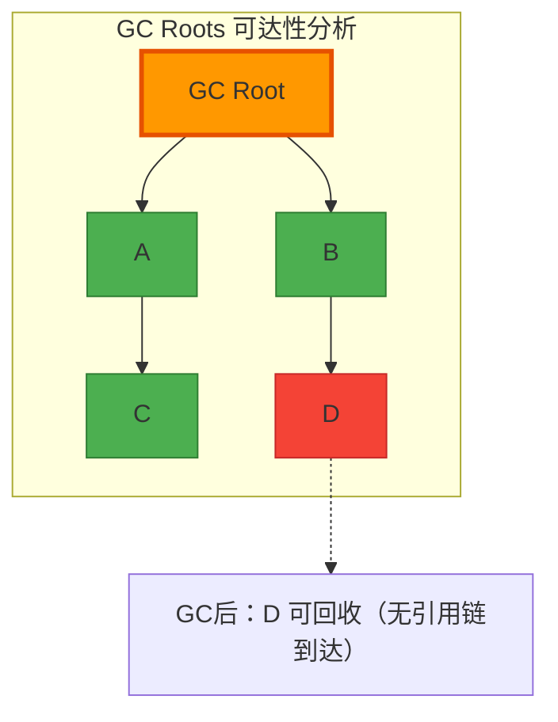

GC Roots 包括：
- 虚拟机栈中引用的对象
- 方法区中类静态属性引用的对象
- 方法区中常量引用的对象
- 本地方法栈中 JNI 引用的对象

### 3.2 垃圾回收算法

#### 标记-清除算法

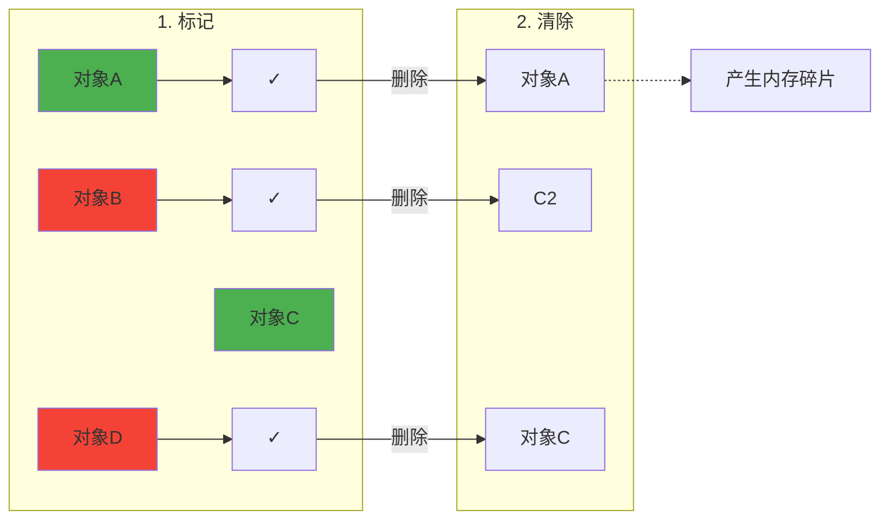

缺点：产生内存碎片、效率不高

#### 复制算法

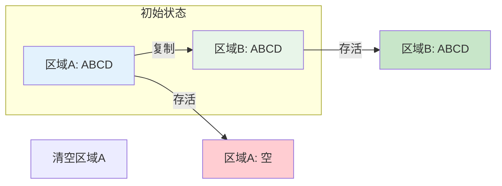

优点：无碎片、简单高效 | 缺点：可用内存减半 | 适用于：新生代

#### 标记-整理算法

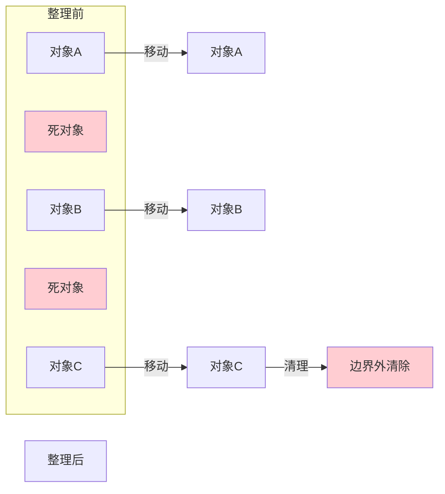

优点：无碎片、内存利用率高 | 适用于：老年代

### 3.3 垃圾收集器

#### 各年代收集器组合

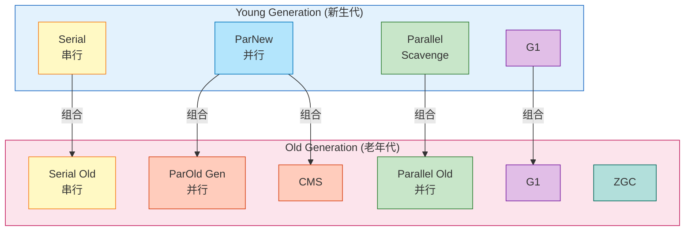

#### 常见收集器对比

| 收集器 | 串行/并行 | 作用区域 | 特点 | 适用场景 |
|--------|----------|----------|------|----------|
| **Serial** | 串行 | Young/Old | 单线程、STW | 单核、Client |
| **ParNew** | 并行 | Young | 多线程、STW | 多核、Server |
| **Parallel** | 并行 | Young | 吞吐量优先 | 后台计算 |
| **Serial Old** | 串行 | Old | 单线程 | 单核、Client |
| **Parallel Old** | 并行 | Old | 吞吐量优先 | 后台计算 |
| **CMS** | 并发 | Old | 低延迟 | 互联网应用 |
| **G1** | 并发 | 全堆 | 可预测延迟 | 大堆、通用 |
| **ZGC** | 并发 | 全堆 | 毫秒级延迟 | 超大堆 |

### 3.4 G1 收集器详解

G1（Garbage-First）是目前最常用的收集器：

```
G1 内存布局：
┌─────────────────────────────────────────────────────────┐
│                    Heap (2G)                          │
├─────────────────────────────────────────────────────────┤
│ ┌──────┐ ┌──────┐ ┌──────┐ ┌──────┐ ┌──────┐ ┌─────┐ │
│ │Region│ │Region│ │Region│ │Region│ │Region│ │... │ │
│ │ 1M   │ │ 1M   │ │ 1M   │ │ 1M   │ │ 1M   │ │    │ │
│ └──────┘ └──────┘ └──────┘ └──────┘ └──────┘ └─────┘ │
│                                                         │
│  Region 类型：                                          │
│  • Eden Region (新对象)                                │
│  • Survivor Region (存活对象)                          │
│  • Old Region (老对象)                                  │
│  • Humongous Region (大对象 > 50% Region)              │
└─────────────────────────────────────────────────────────┘
```

G1 的工作流程：

```
1. Young GC
   - 收集年轻代中的 Eden 和 Survivor
   - 复制到新的 Survivor 或 Old

2. Mixed GC
   - 收集所有年轻代 + 部分老年代
   - 优先回收价值最高的海陆

3. Full GC
   - 串行/并行 GC
   - 收拾不了的极端情况
```

---

## 4. 类加载机制

### 4.1 类加载过程

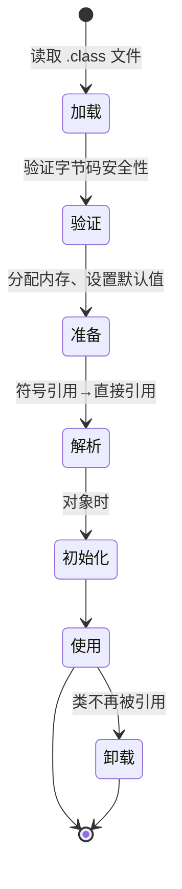

### 4.2 类加载器层次

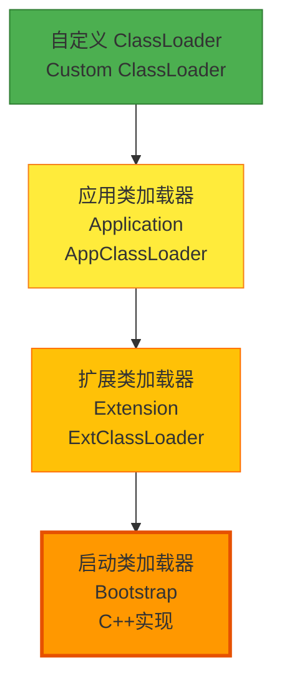

### 4.3 双亲委派模型

```mermaid
flowchart TB
    Start["loadClass()"] --> Check{检查是否<br/>已加载}
    Check -->|已加载| Return["返回类"]

    Check -->|未加载| Delegate["委派给父加载器"]

    Delegate --> Top{父加载器<br/>是否为空}

    Top -->|是| Load["自己加载<br/>(findClass)"]

    Top -->|否| Delegate

    Load --> Return

    subgraph 递归向上
        direction TB
        A[App ClassLoader]
        B[Ext ClassLoader]
        C[Bootstrap]
    end

    Delegate -.-> A
    A -.-> B
    B -.-> C

    目的:
    目的 -.-> 防止类的重复加载
    目的 -.-> 保证Java核心类库的安全性

    style Start fill:#e3f2fd,stroke:#1565c0
    style Check fill:#fff3e0,stroke:#e65100
    style Return fill:#e8f5e9,stroke:#2e7d32
    style Delegate fill:#fce4ec,stroke:#c2185b
    style Load fill:#e1bee7,stroke:#7b1fa2
│           ▼                            │
│  ┌─────────────────┐                   │
│  │ 父类加载器.loadClass()              │
│  └────────┬────────┘                   │
│           │                            │
│           ▼ (递归向上)                 │
│     ┌─────────────┐                    │
│     │ Bootstrap   │                    │
│     │ ClassLoader │                    │
│     └──────┬──────┘                    │
│            │ 无法加载                   │
│            ▼                           │
│  ┌─────────────────┐                   │
│  │ 自己加载        │                   │
│  │ (findClass)    │                   │
│  └─────────────────┘                   │
└─────────────────────────────────────────┘
```

### 4.4 打破双亲委派

```
常见场景：
1. Tomcat：每个 Web 应用加载自己的类
2. OSGi：模块化加载
3. JDBC：SPI 机制
4. 动态代理：运行时生成类
```

---

## 5. JVM 性能调优

### 5.1 常用 JVM 参数

#### 堆内存参数

```
-Xms256m          初始堆大小
-Xmx1024m         最大堆大小
-Xmn256m          新生代大小
-XX:MetaspaceSize=128m  元空间初始大小
-XX:MaxMetaspaceSize=256m 元空间最大大小
-XX:NewRatio=2     新生代:老年代 = 1:2
-XX:SurvivorRatio=8 Eden:Survivor = 8:1
```

#### GC 参数

```
-XX:+UseSerialGC        Serial 收集器
-XX:+UseParallelGC      Parallel Scavenge 收集器
-XX:+UseConcMarkSweepGC  CMS 收集器
-XX:+UseG1GC            G1 收集器
-XX:+UseZGC             ZGC 收集器

-XX:MaxGCPauseMillis=200 最大 GC 停顿时间
-XX:G1HeapRegionSize=1m  G1 Region 大小
-XX:InitiatingHeapOccupancyPercent=45  触发 Mixed GC 阈值
```

#### 其他参数

```
-XX:+HeapDumpOnOutOfMemoryError  OOM 时导出堆文件
-XX:HeapDumpPath=/tmp/heap.hprof 堆文件路径
-XX:+PrintGCDetails              打印 GC 详情
-XX:+PrintGCDateStamps           打印 GC 时间戳
-Xloggc:/tmp/gc.log             GC 日志文件
```

### 5.2 调优思路

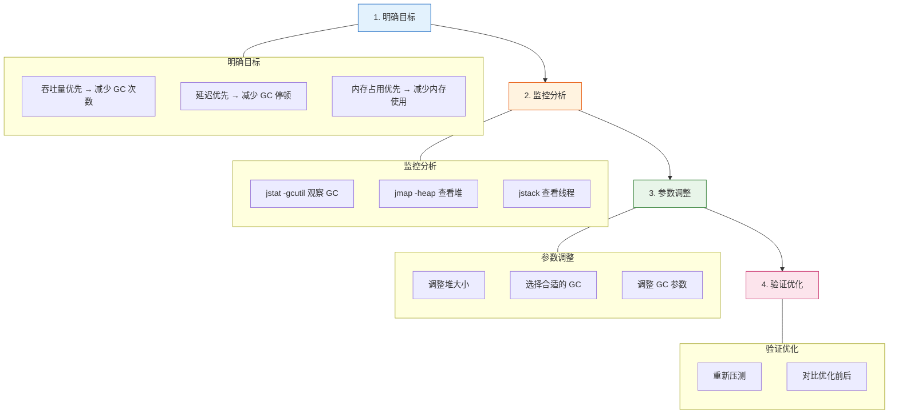

### 5.3 推荐配置

#### G1 调优示例

```
# 4核8G服务器推荐配置
java -Xms4g -Xmx4g \
     -XX:+UseG1GC \
     -XX:MaxGCPauseMillis=200 \
     -XX:G1HeapRegionSize=8m \
     -XX:InitiatingHeapOccupancyPercent=45 \
     -XX:+ParallelRefProcEnabled \
     -XX:G1ReservePercent=15 \
     -XX:MaxTenuringThreshold=15 \
     -XX:+HeapDumpOnOutOfMemoryError \
     -XX:HeapDumpPath=/tmp/heap.hprof \
     -Xloggc:/tmp/gc.log \
     -XX:+PrintGCDetails \
     -XX:+PrintGCDateStamps \
     -jar app.jar
```

---

## 6. 实战问题排查

### 6.1 常用排查工具

```
命令工具：
• jps        查看 Java 进程
• jstat      查看 GC 统计
• jinfo      查看/修改 JVM 参数
• jstack     查看线程堆栈
• jmap       查看内存映射、生成堆转储
• jcmd       综合工具（Java 9+）

可视化工具：
• jconsole   JVM 监控
• jvisualvm  性能分析
• Java Mission Control (JMC)
• Async-profiler
```

### 6.2 常见问题排查

#### 问题一：CPU 100%

```
排查步骤：
1. top 找到占用高的进程 PID
2. top -Hp PID 找到占用高的线程 TID
3. printf '%x\n' TID 转换为十六进制
4. jstack PID | grep TID十六进制 查看堆栈
```

#### 问题二：内存持续增长

```
排查步骤：
1. jmap -heap PID 查看堆使用情况
2. jmap -dump:format=b,file=heap.hprof PID 导出堆文件
3. 使用 MAT / jvisualvm 分析内存泄漏
4. 定位泄漏对象和引用链
```

#### 问题三：GC 频繁或停顿长

```
排查步骤：
1. jstat -gcutil PID 1000 观察 GC 情况
2. 分析 GC 日志
3. 调整堆大小或 GC 参数
4. 考虑更换 GC 收集器
```

### 6.3 GC 日志分析

```
典型 Young GC 日志：
[2024-01-15T10:23:45.123+0800]: [GC (Allocation Failure)
  PSYoungGen: 524800K->32000K(611840K)]
  786240K->258240K(2097152K), 0.0156789 secs]
  [Times: user=0.12 sys=0.01, real=0.02 secs]

含义：
• Allocation Failure：分配失败（Eden 区满）
• PSYoungGen：年轻代
• 524800K->32000K：GC 前使用 524M，GC 后 32M
• (611840K)：年轻代总大小
• 786240K->258240K：堆使用从 768M 降到 252M
• 0.0156789 secs：GC 耗时 15.7ms
```

---

## 附录：JVM 参数速查表

### 常用参数分类

```
■ 堆内存
-Xms                初始堆大小
-Xmx                最大堆大小
-Xmn                新生代大小
-XX:NewRatio        新生代/老年代比例
-XX:SurvivorRatio   Eden/Survivor 比例

■ 线程
-Xss                线程栈大小

■ 元空间
-XX:MetaspaceSize   元空间初始大小
-XX:MaxMetaspaceSize 元空间最大大小

■ GC
-XX:+UseSerialGC           串行 GC
-XX:+UseParallelGC         并行 GC
-XX:+UseConcMarkSweepGC    CMS GC
-XX:+UseG1GC               G1 GC
-XX:MaxGCPauseMillis       最大 GC 停顿时间

■ 日志
-Xloggc:                  GC 日志文件
-XX:+PrintGCDetails        详细 GC 日志
-XX:+PrintGCDateStamps     时间戳

■ 调试
-XX:+HeapDumpOnOutOfMemoryError  OOM 时导出堆
-XX:HeapDumpPath               堆文件路径
```

---

## 结语

理解 JVM 是 Java 工程师进阶的必经之路：

```
JVM 核心知识：
• 内存模型 → 理解对象创建与回收
• 类加载 → 理解类的生命周期
• GC 机制 → 理解内存管理
• 性能调优 → 解决生产问题
```

> "纸上得来终觉浅，绝知此事要躬行。"
> 推荐阅读：《深入理解 Java 虚拟机》- 周志明

---

> 💭 思考题：在你的工作中遇到过哪些 JVM 相关的问题？你是如何排查和解决的？
