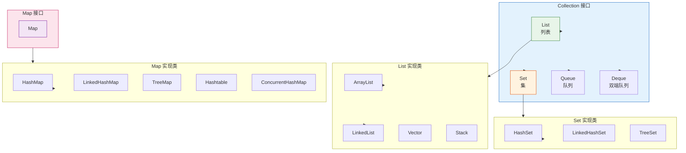
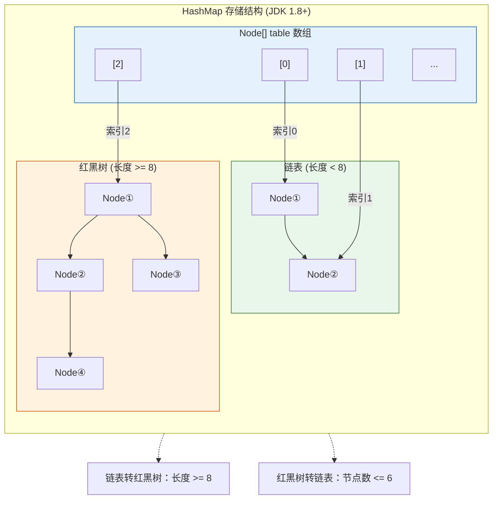

# Java 集合框架深入理解

> "集合框架是 Java 开发的基础，也是面试高频考点。"

---

## 目录

1. [集合框架概述](#1-集合框架概述)
2. [List 接口与实现类](#2-list-接口与实现类)
3. [Map 接口与实现类](#3-map-接口与实现类)
4. [Set 接口与实现类](#4-set-接口与实现类)
5. [并发集合](#5-并发集合)
6. [集合的选用策略](#6-集合的选用策略)

---

## 1. 集合框架概述

### 1.1 整体架构



### 1.2 常见集合对比

| 集合 | 有序 | 线程安全 | 底层结构 | 查找 | 插入/删除 |
|------|------|----------|----------|------|-----------|
| ArrayList | 是 | 否 | 数组 | O(1) | O(n) |
| LinkedList | 是 | 否 | 双向链表 | O(n) | O(1) |
| HashMap | 否 | 否 | 数组+链表/红黑树 | O(1) | O(1) |
| LinkedHashMap | 是 | 否 | 数组+链表+双向链表 | O(1) | O(1) |
| TreeMap | 是 | 否 | 红黑树 | O(log n) | O(log n) |
| HashSet | 否 | 否 | HashMap | O(1) | O(1) |
| ConcurrentHashMap | 否 | 是 | 数组+链表/红黑树 | O(1) | O(1) |

---

## 2. List 接口与实现类

### 2.1 ArrayList 源码解析

ArrayList 是最常用的 List 实现类：

```java
// ArrayList 核心结构
public class ArrayList<E> extends AbstractList<E>
        implements List<E>, RandomAccess, Cloneable, Serializable {

    // 底层使用 Object 数组
    transient Object[] elementData;

    // 实际元素个数
    private int size;

    // 默认容量
    private static final int DEFAULT_CAPACITY = 10;
}
```

#### 添加元素流程

```
┌─────────────────────────────────────────────────────────────┐
│                 ArrayList add(E e) 流程                     │
├─────────────────────────────────────────────────────────────┤
│                                                             │
│  1. 确保容量                                                 │
│     ┌─────────────────────────────────────────────────┐    │
│     │ if (size + 1 > elementData.length)            │    │
│     │     grow(size + 1);  // 扩容                   │    │
│     └─────────────────────────────────────────────────┘    │
│                                                             │
│  2. 扩容机制                                                │
│     • 新容量 = 旧容量 + 旧容量/2 (1.5倍)                   │
│     • 如果是空数组，扩容到 DEFAULT_CAPACITY (10)           │
│     • 使用 Arrays.copyOf 复制数组                           │
│                                                             │
│  3. 添加元素                                                │
│     elementData[size++] = e;                               │
│                                                             │
└─────────────────────────────────────────────────────────────┘
```

#### 扩容源码

```java
private void grow(int minCapacity) {
    // 获取旧容量
    int oldCapacity = elementData.length;

    // 新容量 = 旧容量 * 1.5
    int newCapacity = oldCapacity + (oldCapacity >> 1);

    // 如果新容量不够，直接用 minCapacity
    if (newCapacity - minCapacity < 0)
        newCapacity = minCapacity;

    // 如果新容量超过最大限制，调用 hugeCapacity
    if (newCapacity - MAX_ARRAY_SIZE > 0)
        newCapacity = hugeCapacity(minCapacity);

    // 数组复制
    elementData = Arrays.copyOf(elementData, newCapacity);
}
```

### 2.2 ArrayList vs LinkedList

```
┌─────────────────────────────────────────────────────────────┐
│            ArrayList vs LinkedList 对比                    │
├─────────────────────────────────────────────────────────────┤
│                                                             │
│  ArrayList                                                  │
│  ┌───┬───┬───┬───┬───┬───┐                                │
│  │ 0 │ 1 │ 2 │ 3 │ 4 │...│  连续内存                    │
│  └───┴───┴───┴───┴───┴───┘                                │
│    ↑                              ↑                        │
│   head                           tail                     │
│                                                             │
│  优点：                                                     │
│  • 按索引访问 O(1)                                         │
│  • 内存连续，CPU 缓存命中率高                               │
│  • 占用内存小                                             │
│                                                             │
│  缺点：                                                     │
│  • 插入/删除 O(n)                                          │
│  • 扩容需要复制数组                                        │
│                                                             │
│ ─────────────────────────────────────────────              │
│                                                             │
│  LinkedList                                                │
│  ┌───┐   ┌───┐   ┌───┐   ┌───┐                           │
│  │ 0 │──▶│ 1 │──▶│ 2 │──▶│ 3 │  双向链表                │
│  └───┘   └───┘   └───┘   └───┘                           │
│                                                             │
│  优点：                                                     │
│  • 插入/删除 O(1)（已知位置）                              │
│  • 无需扩容                                                │
│                                                             │
│  缺点：                                                     │
│  • 按索引访问 O(n)                                         │
│  • 内存不连续                                              │
│  • 占用内存大（需要存储前后指针）                          │
│                                                             │
└─────────────────────────────────────────────────────────────┘
```

### 2.3 Vector 与 Stack

```
Vector vs ArrayList：
• Vector 线程安全（synchronized 方法）
• Vector 扩容是 2 倍（ArrayList 是 1.5 倍）
• 性能不如 ArrayList，推荐用 Collections.synchronizedList

Stack：
• 继承自 Vector
• push(), pop(), peek()
• 已废弃，推荐使用 Deque
```

---

## 3. Map 接口与实现类

### 3.1 HashMap 源码解析

HashMap 是最常用的 Map 实现类：

```java
public class HashMap<K,V> extends AbstractMap<K,V>
        implements Map<K,V>, Cloneable, Serializable {

    // 底层数组
    transient Node<K,V>[] table;

    // 元素个数
    transient int size;

    // 扩容阈值 = capacity * loadFactor
    int threshold;

    // 负载因子
    final float loadFactor;

    // 默认参数
    static final int DEFAULT_INITIAL_CAPACITY = 16;
    static final float DEFAULT_LOAD_FACTOR = 0.75f;
}
```

#### 存储结构 (JDK 1.8+)



#### put 流程

```java
public V put(K key, V value) {
    return putVal(hash(key), key, value, false, true);
}

final V putVal(int hash, K key, V value, boolean onlyIfAbsent,
               boolean evict) {
    Node<K,V>[] tab; Node<K,V> p; int n, i;

    // 1. 初始化数组
    if ((tab = table) == null || (n = tab.length) == 0)
        n = (tab = resize()).length;

    // 2. 计算索引，放入数组
    if ((p = tab[i = (n - 1) & hash]) == null)
        tab[i] = newNode(hash, key, value, null);

    // 3. 索引位置已有元素
    else {
        Node<K,V> e; K k;

        // 3.1 key 相等，替换 value
        if (p.hash == hash && ((k = p.key) == key ||
                (key != null && key.equals(k))))
            e = p;

        // 3.2 红黑树处理
        else if (p instanceof TreeNode)
            e = ((TreeNode<K,V>)p).putTreeVal(this, tab, hash, key, value);

        // 3.3 链表处理
        else {
            for (int binCount = 0; ; ++binCount) {
                if ((e = p.next) == null) {
                    p.next = newNode(hash, key, value, null);
                    // 链表转红黑树
                    if (binCount >= TREEIFY_THRESHOLD - 1)
                        treeifyBin(tab, hash);
                    break;
                }
                // key 相等
                if (e.hash == hash && ((k = e.key) == key ||
                        (key != null && key.equals(k))))
                    break;
                p = e;
            }
        }

        // 替换 value
        if (e != null) {
            V oldValue = e.value;
            if (!onlyIfAbsent || oldValue == null)
                e.value = value;
            afterNodeAccess(e);
            return oldValue;
        }
    }

    // 4. 检查是否需要扩容
    ++modCount;
    if (++size > threshold)
        resize();
    afterNodeInsertion(evict);
    return null;
}
```

#### hash 方法

```java
// JDK 1.8 的 hash 方法
static final int hash(Object key) {
    int h;
    return (key == null) ? 0 :
        (h = key.hashCode()) ^ (h >>> 16);
}

// 目的：高 16 位与低 16 位异或
// 效果：在 table 较小时，让高位也参与运算，减少哈希冲突
```

### 3.2 HashMap 扩容机制

```
┌─────────────────────────────────────────────────────────────┐
│                    HashMap 扩容机制                         │
├─────────────────────────────────────────────────────────────┤
│                                                             │
│  触发条件：size > threshold (capacity * loadFactor)         │
│                                                             │
│  扩容流程：                                                 │
│  1. 新容量 = 旧容量 * 2                                     │
│  2. 新阈值 = 新容量 * loadFactor                            │
│  3. 重新计算每个元素的位置                                   │
│                                                             │
│  重新计算位置：                                            │
│  ┌─────────────────────────────────────────────────┐        │
│  │ 原索引 = oldCap - 1 & hash                      │        │
│  │ 新索引 = newCap - 1 & hash                      │        │
│  │                                                  │        │
│  │ 例如：oldCap = 16, hash = 17                    │        │
│  │ 原索引 = 15 & 17 = 1                            │        │
│  │ 新索引 = 31 & 17 = 17                            │        │
│  │                                                  │        │
│  │ 结果：原索引 = 1, 新索引 = 17                    │        │
│  │ 规律：新索引 = 原索引 + oldCap                   │        │
│  └─────────────────────────────────────────────────┘        │
│                                                             │
│  高位运算作用：                                             │
│  • 只用低 16 位容易碰撞                                     │
│  • 高 16 位与低 16 位异或，让高位也参与                     │
│  • table 长度是 2 的幂，所以 (n-1) & hash 相当于 hash % n   │
│                                                             │
└─────────────────────────────────────────────────────────────┘
```

### 3.3 LinkedHashMap 原理

LinkedHashMap 继承自 HashMap，额外维护了一个双向链表：

```java
// LinkedHashMap 节点
static class Entry<K,V> extends HashMap.Node<K,V> {
    Entry<K,V> before, after;
    Entry(int hash, K key, V value, Node<K,V> next) {
        super(hash, key, value, next);
    }
}

// 维护插入顺序
// 访问顺序（LRU 缓存）：
// LinkedHashMap(int initialCapacity, float loadFactor, boolean accessOrder)
```

### 3.4 TreeMap 原理

TreeMap 基于红黑树实现：

```
TreeMap 特点：
• 按照 key 的自然顺序排序
• 或自定义 Comparator 排序
• 查找、插入、删除都是 O(log n)
• 需要 key 实现 Comparable 或传入 Comparator
```

---

## 4. Set 接口与实现类

### 4.1 HashSet 原理

HashSet 底层使用 HashMap 实现：

```java
public class HashSet<E> extends AbstractSet<E>
        implements Set<E>, Cloneable, Serializable {

    // 底层使用 HashMap
    private transient HashMap<E,Object> map;

    // 所有元素都作为 map 的 key，value 统一为 PRESENT
    private static final Object PRESENT = new Object();

    public boolean add(E e) {
        return map.put(e, PRESENT) == null;
    }
}
```

### 4.2 LinkedHashSet

```
LinkedHashSet = HashSet + 双向链表
• 维护插入顺序
• 查找 O(1)，插入/删除 O(1)
• 有序但性能略低于 HashSet
```

### 4.3 TreeSet

```
TreeSet 底层使用 TreeMap（红黑树）
• 自然排序或自定义排序
• 查找、插入、删除 O(log n)
• 有序，但性能低于 HashSet
```

---

## 5. 并发集合

### 5.1 ConcurrentHashMap

ConcurrentHashMap 是线程安全的 HashMap：

```
JDK 1.7 vs JDK 1.8：

JDK 1.7：
• 分段锁：Segment[] + HashEntry[]
• 每个 Segment 继承 ReentrantLock
• 锁的粒度：Segment 级别

JDK 1.8：
• 数组 + 链表 + 红黑树
• 锁的粒度：Node 级别（synchronized）
• CAS + synchronized
• 推荐使用
```

#### 核心操作

```java
// JDK 1.8 put 流程
public V put(K key, V value) {
    return putVal(key, value, false);
}

final V putVal(K key, V value, boolean onlyIfAbsent) {
    if (key == null || value == null) throw new NullPointerException();

    int hash = spread(key.hashCode());
    int binCount = 0;

    for (Node<K,V>[] tab = table;;) {
        Node<K,V> f; int n, i, fh;

        // 1. 初始化数组
        if (tab == null || (n = tab.length) == 0)
            tab = initTable();

        // 2. 索引位置为空，CAS 插入
        else if ((f = tabAt(tab, i = (n - 1) & hash)) == null) {
            if (casTabAt(tab, i, null, new Node<K,V>(hash, key, value, null)))
                break;
        }

        // 3. 正在扩容，协助扩容
        else if ((fh = f.hash) == MOVED)
            tab = helpTransfer(tab, f);

        // 4. 链表/红黑树插入
        else {
            V oldVal = null;
            synchronized (f) {
                // 双重检查
                if (tabAt(tab, i) == f) {
                    if (fh >= 0) {
                        // 链表
                        binCount = 1;
                        for (Node<K,V> e = f;; ++binCount) {
                            K ek;
                            if (e.hash == hash &&
                                ((ek = e.key) == key ||
                                 (key != null && key.equals(ek)))) {
                                oldVal = e.value;
                                if (!onlyIfAbsent)
                                    e.value = value;
                                break;
                            }
                            Node<K,V> last = e;
                            if ((e = e.next) == null) {
                                last.next = new Node<K,V>(hash, key, value, null);
                                break;
                            }
                        }
                    }
                    else if (f instanceof TreeNode) {
                        // 红黑树
                        binCount = 2;
                        oldVal = ((TreeNode<K,V>)f).putTreeVal(this, tab, hash, key, value);
                    }
                }
            }

            if (binCount != 0) {
                // 链表转红黑树
                if (binCount >= TREEIFY_THRESHOLD)
                    treeifyBin(tab, hash);
                if (oldVal != null)
                    return oldVal;
                break;
            }
        }
    }

    addCount(1, binCount);
    return null;
}
```

### 5.2 CopyOnWriteArrayList

```
原理：写操作时复制整个数组
• 读操作无需加锁
• 写操作需要复制数组
• 适用于读多写少的场景
• 最终一致性

缺点：
• 内存占用高
• 写操作性能差
```

### 5.3 ConcurrentLinkedQueue

```
原理：无界队列，基于 CAS 实现
• 队列为空时 poll() 返回 null
• offer() 成功返回 true
• 高性能，适用于高并发场景
```

---

## 6. 集合的选用策略

### 6.1 List 选用

```
┌─────────────────────────────────────────────────────────────┐
│                      List 选用指南                          │
├─────────────────────────────────────────────────────────────┤
│                                                             │
│  需要随机访问？                                              │
│    ├─ 是 → ArrayList                                       │
│    └─ 否 → LinkedList                                       │
│                                                             │
│  需要线程安全？                                              │
│    ├─ 是 → Vector / Collections.synchronizedList          │
│    └─ 否 → ArrayList / LinkedList                          │
│                                                             │
│  需要实现栈/队列？                                           │
│    └─ LinkedList (实现 Deque 接口)                         │
│                                                             │
└─────────────────────────────────────────────────────────────┘
```

### 6.2 Map 选用

```
┌─────────────────────────────────────────────────────────────┐
│                      Map 选用指南                          │
├─────────────────────────────────────────────────────────────┤
│                                                             │
│  需要 key 排序？                                             │
│    ├─ 是 → TreeMap                                         │
│    └─ 否 →                                                 │
│                                                             │
│  需要保持插入顺序？                                          │
│    ├─ 是 → LinkedHashMap                                   │
│    └─ 否 →                                                 │
│                                                             │
│  需要线程安全？                                              │
│    ├─ 是 → ConcurrentHashMap / Hashtable                   │
│    │         (推荐 ConcurrentHashMap)                       │
│    └─ 否 → HashMap                                          │
│                                                             │
│  需要弱引用？                                                │
│    └─ WeakHashMap                                          │
│                                                             │
└─────────────────────────────────────────────────────────────┘
```

### 6.3 性能数据参考

```
┌─────────────────────────────────────────────────────────────┐
│                   性能数据参考                             │
├─────────────────────────────────────────────────────────────┤
│                                                             │
│  操作耗时（1000万元素）：                                    │
│                                                             │
│  HashMap:                                                  │
│    • get:     ~1ms                                         │
│    • put:     ~1ms                                         │
│    • iterate: ~50ms                                        │
│                                                             │
│  ArrayList:                                                │
│    • get:    ~0.1ms                                        │
│    • add:    ~0.1ms                                        │
│    • remove: ~10ms (平均)                                  │
│    • iterate: ~5ms                                         │
│                                                             │
│  LinkedList:                                              │
│    • get:    ~50ms (平均)                                  │
│    • add:    ~0.1ms                                       │
│    • remove: ~0.1ms (已知位置)                             │
│    • iterate: ~10ms                                        │
│                                                             │
│  TreeMap:                                                  │
│    • get:    ~10ms                                         │
│    • put:    ~10ms                                         │
│                                                             │
└─────────────────────────────────────────────────────────────┘
```

---

## 常见面试题

```
1. HashMap 的底层实现？
   → JDK 1.8: 数组+链表+红黑树，链表转红黑树条件：长度>=8

2. HashMap 为什么线程不安全？
   → 多线程扩容时可能形成环形链表

3. HashMap 扩容时为什么是 2 倍？
   → 让哈希分布更均匀，(n-1) & hash 相当于 hash % n

4. ConcurrentHashMap 如何保证线程安全？
   → JDK 1.8: CAS + synchronized，锁住单个 Node

5. ArrayList 和 LinkedList 的区别？
   → 数组 vs 链表，按索引访问 vs 插入删除

6. HashSet 如何检查重复？
   → 调用 hashCode() 和 equals()
```

---

## 结语

```
集合框架核心要点：
• ArrayList：动态数组，查询快增删慢
• LinkedList：双向链表，增删快查询慢
• HashMap：数组+链表+红黑树，O(1) 操作
• ConcurrentHashMap：线程安全的 HashMap
• HashSet：基于 HashMap，O(1) 查找
```

> 理解原理才能更好地使用和优化。

---

> 💭 思考题：你在实际项目中使用集合时遇到过哪些性能问题？
